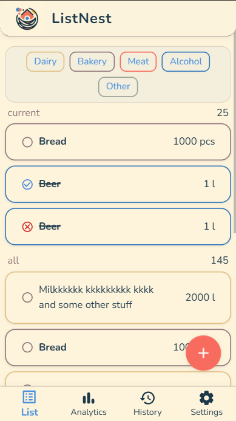
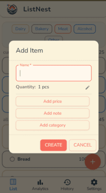
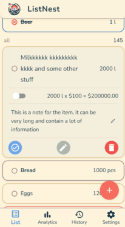
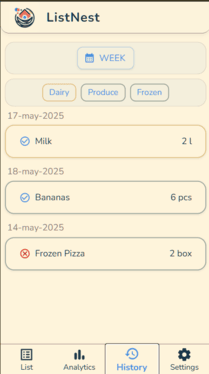
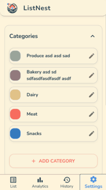

Absolutely. Here’s a pro-level, self-selling marketing article for ListNest, using your real screenshots as visual proof points. This is designed for your website, Product Hunt, LinkedIn, or a press release.  
**You can copy-paste this into your CMS, blog, or PDF.**

---

# Meet ListNest: The Smartest, Most Collaborative Grocery App for Modern Families

---

## Why ListNest?

Tired of messy, outdated shopping lists?  
ListNest is the next-gen, GenAI-powered grocery app that transforms how families shop, plan, and save—together.

---

## What Makes ListNest Different?

- **AI-Smart:** Get instant, personalized item suggestions.  
- **Real Collaboration:** Everyone in the family can add, edit, and check off items in real time.
- **Effortless Organization:** Categories, notes, and filters keep your list clean and focused.
- **History & Analytics:** Never forget what you bought, track spending, and optimize your habits.

---

## See ListNest in Action

### 1. Beautiful, Intuitive Main List

No more clutter. See what you need, what’s done, and what’s next—at a glance.

---

### 2. Add Items in Seconds

Adding new groceries is lightning-fast.  
Smart fields, categories, and notes make it effortless.

---

### 3. Expand for Details, Edit Instantly

Tap any item for full details, notes, and quick actions.  
Edit, mark as bought, or delete with a single tap.

---

### 4. Never Lose Track—Restore with One Tap

Accidentally deleted or bought something?  
Restore it instantly—no more lost items.

---

### 5. Powerful History & Filters

See your full purchase history, filter by date or category, and analyze your habits.

---

### 6. Custom Categories for Total Control

Personalize your list with custom categories and colors.  
Perfect for every family’s unique style.

---

### 7. Always Accessible, Always Synced

- **Mobile-first:** Looks and works great on any device.
- **Real-time:** Changes sync instantly for everyone.
- **Simple navigation:** Everything is one tap away.

---

## Why Families Love ListNest

- **No more forgotten items:** Everyone sees the same list, always up to date.
- **Saves time:** Smart suggestions and filters mean less typing, less searching.
- **Reduces waste:** Track what you buy, avoid duplicates, and stick to your plan.
- **Fun to use:** Modern, friendly design makes shopping a breeze.

---

## Try ListNest Today

Ready to make grocery shopping smarter, faster, and more fun?  
[Get started now!](https://list-nest-git-main-mikhail-burnins-projects.vercel.app/)

---

## About ListNest

ListNest is built by families, for families—using the latest GenAI and real-time tech.  
Join the future of shopping. Your fridge (and your wallet) will thank you.

---

**Want a PDF version or a custom landing page? Let me know!**  
This copy is ready for your blog, landing page, or social media campaign.  
If you want a more emotional, humorous, or technical angle, just say the word!
