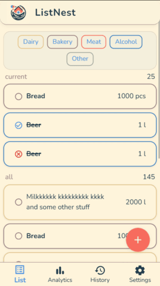
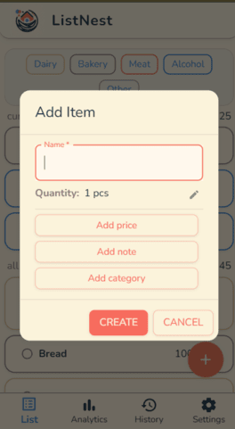
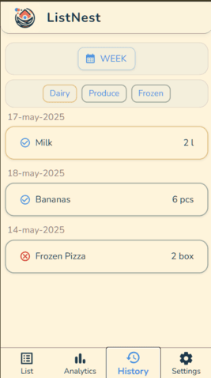
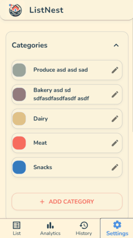

**ListNest MVP Description**

ListNest is a collaborative grocery shopping app designed for families. The MVP focuses on core list management, real-time collaboration, and simple organization. Users can add, edit, and categorize items, track what’s bought, and view their shopping history. The interface is mobile-first, intuitive, and supports basic category management.

**Key MVP Features:**
- Add, edit, and delete grocery items
- Mark items as bought or restore them
- Organize items by custom categories
- View purchase history, filter by date/category
- Simple, responsive UI for mobile use

**Representative Screenshots:**

- **Main List:**  
  

- **Add Item Modal:**  
  

- **History List:**  
  

- **Categories Management:**  
  

---

This covers the essential MVP scope and shows the most relevant UI states.
