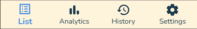
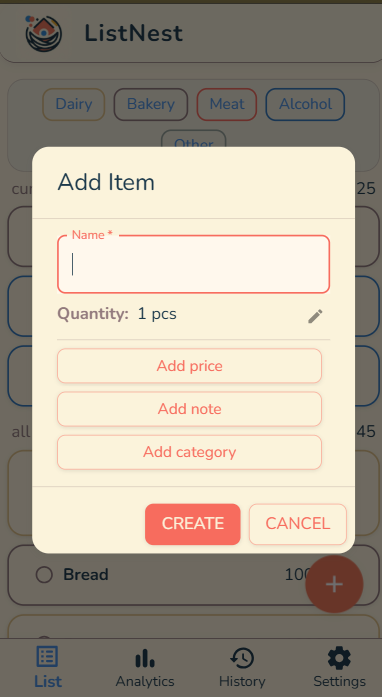
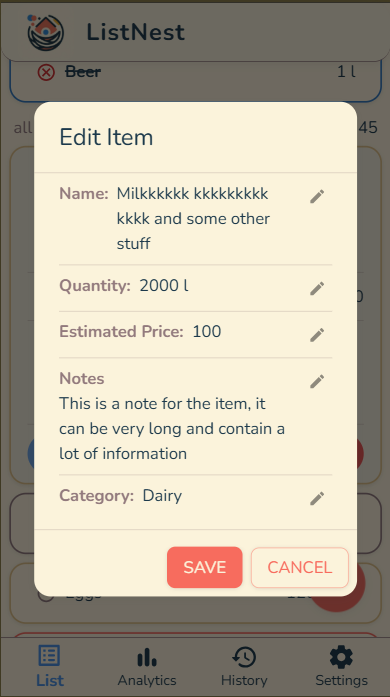
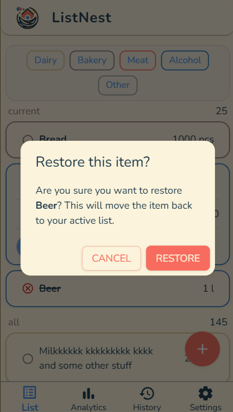
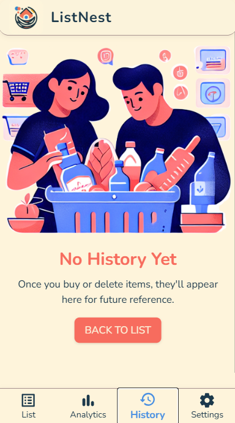
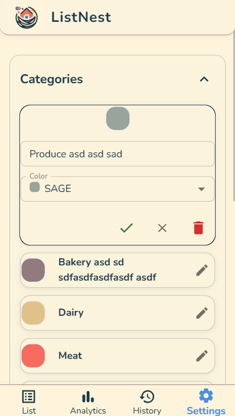
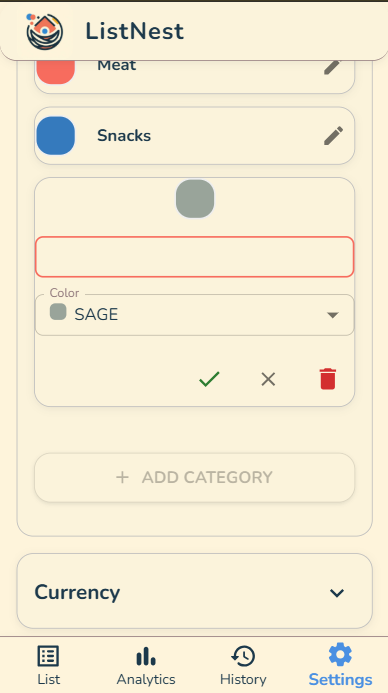
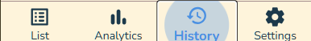

# ListNest Frontend User Guide

## Overview
ListNest is a GenAI-powered collaborative grocery shopping app for families.  
You can add, edit, organize, and track your shopping items, view history, and manage categories—all in a modern, mobile-friendly UI.

---

## 1. Navigation

**Footer Navigation:**  
  
List, Analytics, History, Settings tabs for quick access.

---

## 2. Main List

**Empty State:**  
  
Shown when you have no items. Tap "Add First Item" to start.

**Main List with Items:**  
  
View, filter, and manage your current and all items.  
Use category chips to filter.

**Add Item:**  
  
Tap the "+" button to add a new item.  
Enter name, quantity, price, note, and category.

**Expanded Item:**  
  
Tap an item to expand and see details, notes, and actions.

**Edit Item (View/Edit):**  
  
Edit any field by tapping the pencil icon.

**Edit Item (Editing Field):**  
  
Active field editing with validation.

**Delete Item Confirmation:**  
  
Confirm before deleting (item can be restored later).

**Restore Item Confirmation:**  
  
Restore deleted/bought items to the active list.

---

## 3. History

**Empty State:**  
  
No history yet—appears after you buy/delete items.

**History List:**  
  
View past items, grouped by date.  
Filter by date range and category.

**Select Date Range:**  
  
Choose preset or custom date ranges for filtering.

---

## 4. Settings

**Categories List:**  
  
View and manage item categories.

**Edit Category:**  
  
Edit name and color, or delete a category.

**Add Category:**  
  
Add a new category with a name and color.

---

## 5. Footer Navigation (All States)

**List Tab Selected:**  

**Analytics Tab Selected:**  

**History Tab Selected:**  

**Settings Tab Selected:**  

---

## Tips

- All actions are accessible via the bottom nav.
- Items can be restored from history.
- Categories are fully customizable.
- Empty states guide new users.
- All modals are mobile-optimized.

---

## Appendix

- For more info, see [project site](https://list-nest-git-main-mikhail-burnins-projects.vercel.app/).
- For technical details, see the project README and docs.

---
